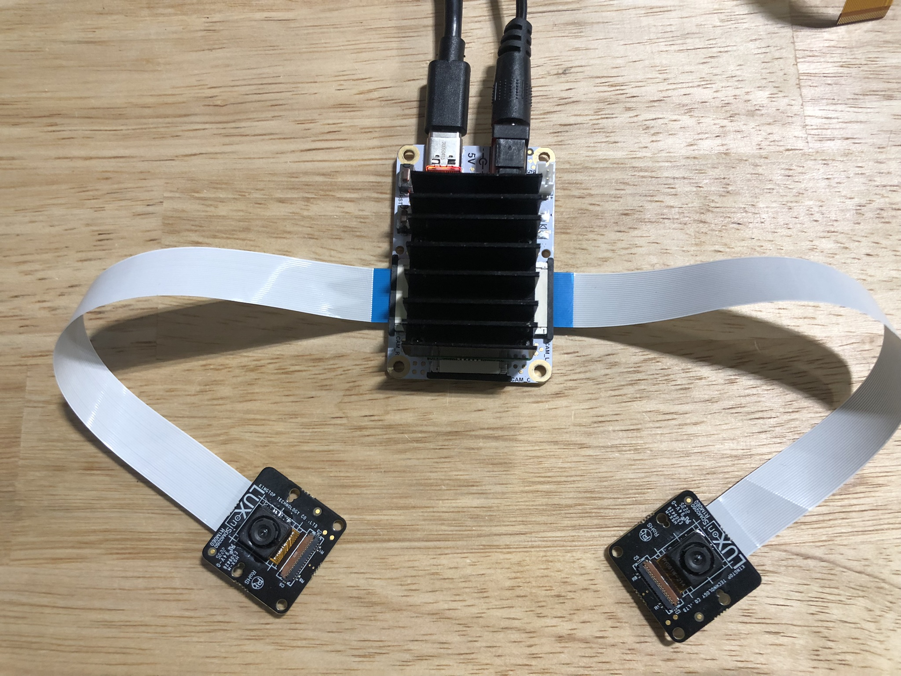
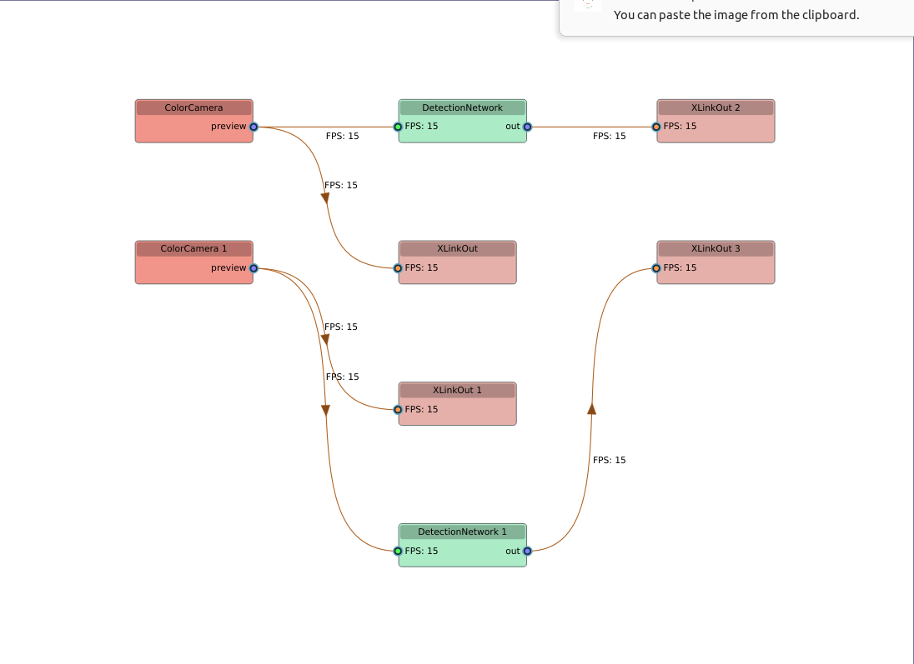
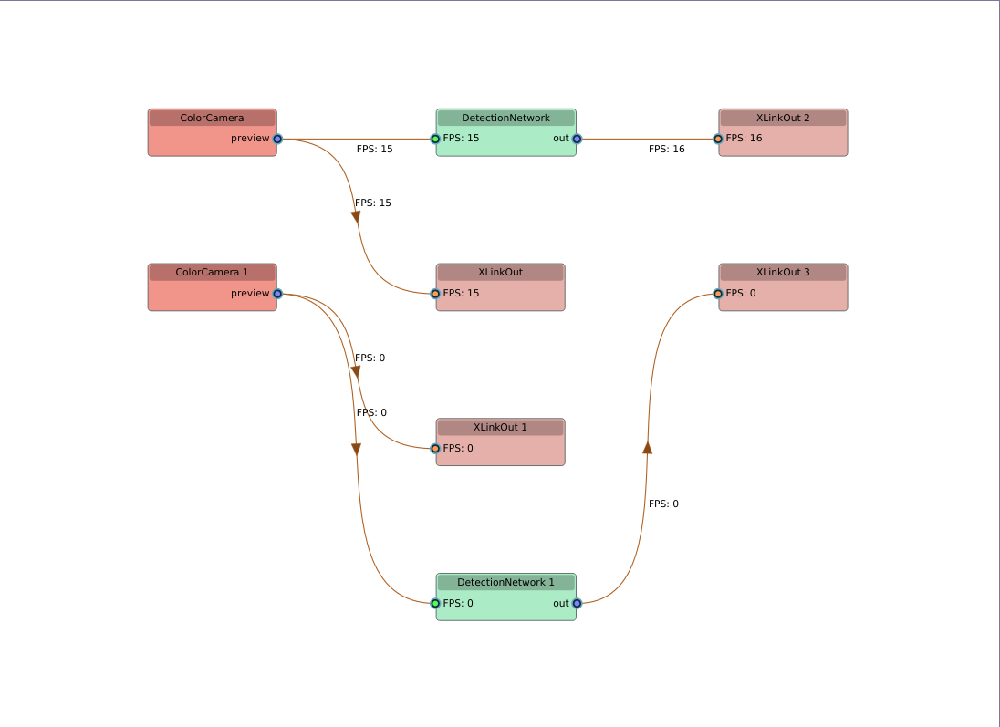

# depthai_dual_cam_ros_detector

This repo provides the code and instructions to reproduce an issue I encounter while running a depthai pipeline of two color cameras and detection networks with OAK-FFC-3P. The issue happens specifically when connecting with two IMX577 modules from [Arducam](https://www.arducam.com/product/arducam-12mp-imx477-mini-high-quality-camera-with-m12-mount-lens-for-depthai-oak-dm1090ffc-b0346/).

## Hardware

### OAK-FFC-3P configuration

As comparison, we also ran the same pipeline with [IMX214](https://shop.luxonis.com/collections/oak-modules/products/oak-ffc-imx2147-w) from Luxonis. Here are the two configuration.

- 2-IMX577: OAK-FFC-3P with two IMX577 modules on CAM_B and CAM_C

- 2-IMX219: OAK-FFC-3P with two IMX214 modules on CAM_B and CAM_C

### The hosts

All the tests have been run with two different hosts seperately for comparison.

- workstation host: a laptop running Ubuntu 22.04.3
- pi host: a Raspberry Pi 4 Model B with precompiled Depthai OS (OAK_CM4_POE_V10_64bit, Debian GNU/Linux 12 bookworm).

## Reproduce the issue

I built a docker image with depthai-ros noetic and our minimum reproducible application. A run script `run.sh` will launch the pipeline and use `pipeline_graph` to show the pipeline details.

### Steps

- Clone this repo by `git clone https://github.com/lincolnxlw/depthai_dual_cam_ros_detector.git`.
- Download my prebuilt docker image by `docker pull lincolnxlw/my-depthai-ros`.
- Run the main script in the repo's root folder `./run.sh`.

### Expected behavior

Both camera nodes should return expected 15 FPS.

### Observed behavior

With configuration 2-IMX577, one camera will return 0 FPS and never recover during run.

## Detailed test results

workstation host

- 2-IMX577: failed 9 times out of 30 times 
- 2-IMX219: failed 0 times out of 30 times

pi host

- 2-IMX577:
- 2-IMX219:

